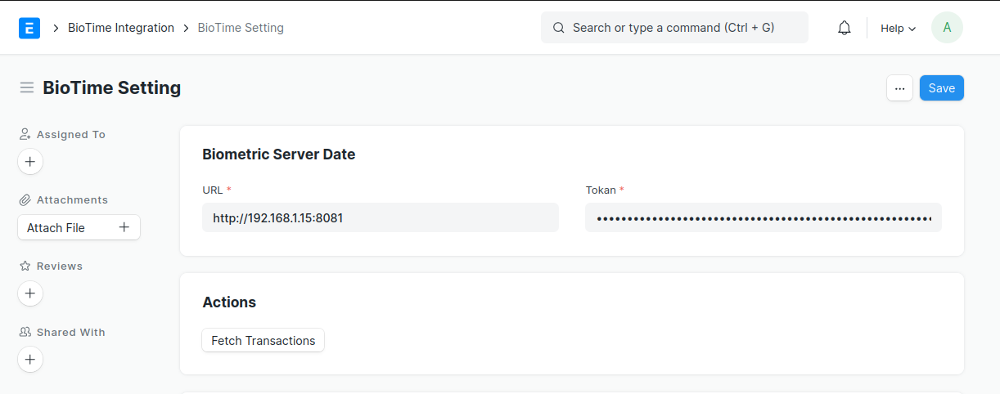
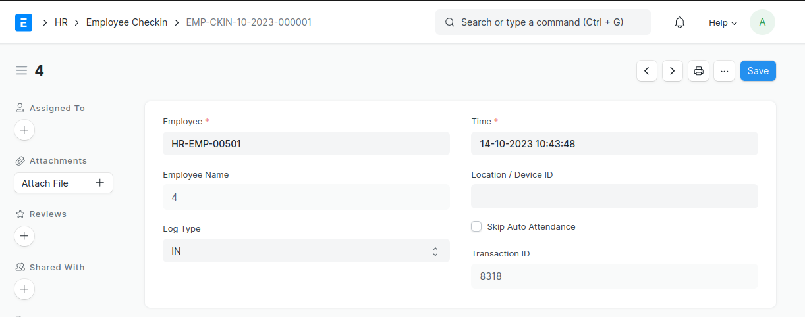
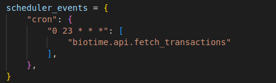
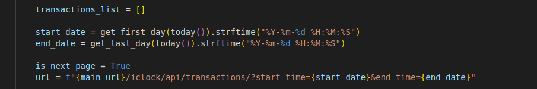

## BioTime Integration

Integration with BioTime servers to fetch check-in list

#### License

MIT

## Introduction

This documentation outlines the process for integrating ERPNext with the BioTime system to fetch check-in data from the BioTime system. This integration will require the BioTime URL and a JWT token for authentication. Additionally, a field, "Attendance Device ID (Biometric/RF tag ID)," is used to map check-ins from the device with the employee list. To avoid duplicate transactions, a "Transaction ID" field is added to the Chicken DocType. Check-ins will be fetched daily at midnight.

## Prerequisites

Before proceeding with the integration, ensure the following prerequisites are met:

    Access to BioTime: You must have access to the BioTime system, including the BioTime URL and a valid JWT token for authentication.

## Integration Steps
1. BioTime URL and JWT Token

    BioTime URL: The BioTime URL is the base URL of the BioTime system where the API endpoints are hosted.

    JWT Token: You'll need a JWT (JSON Web Token) for authentication. This token should be obtained from the BioTime system. Make sure the token has the necessary permissions to access the required data.

    2. Custom Field Setup

To facilitate the integration and prevent duplicate transactions, a custom field is added to the Chicken DocType.

    Field Name: "Transaction ID"
    Type: Data
    Description: Used to store a unique identifier for each transaction to avoid duplicates.

    

    This field will be used to match check-in transactions from BioTime with corresponding records in ERPNext.

    3. Schedule Data Fetch

The check-in data from BioTime should be fetched daily at midnight. The scheduled task should use the credentials to access BioTime and update ERPNext records accordingly.

4. Data Mapping

    Attendance Device ID (Biometric/RF tag ID): This field is used to map check-ins from the device with the employee list. Ensure that the BioTime data includes the corresponding employee's device ID or tag ID to establish the connection.

5. Data Fetch and Update

    Use the BioTime URL and JWT token to authenticate and access the BioTime API.
    Fetch check-in data from BioTime nearly at midnight ( axactly at 23:00 every day) check the check-in for -this- month and fetch it every day.
    Map the fetched data with employee records in ERPNext using the "Attendance Device ID."
    Ensure that the "Transaction ID" field is used to prevent duplicate transactions.

    